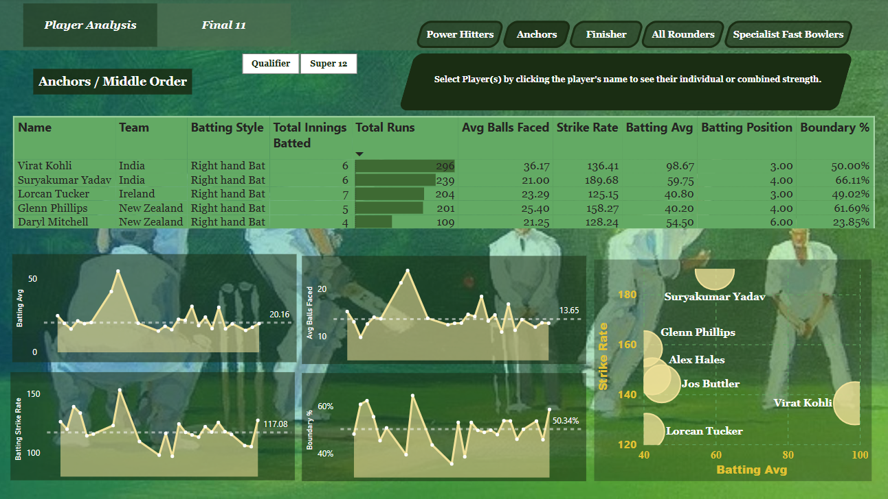
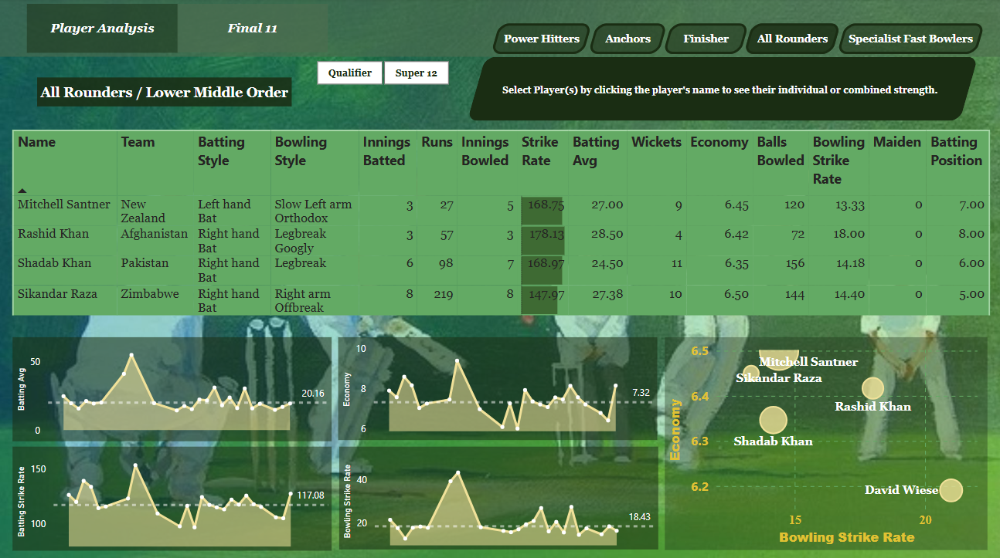

# Introduction
This project aims to provide a detailed, data-driven analysis of player performances during the T20 World Cup, using modern data analytics techniques to evaluate key metrics and identify patterns. The primary objective is to assess the effectiveness of players across various roles, such as Power Hitters, Openers, Anchors, All-Rounders, Finishers, and Specialist Fast Bowlers, based on their in-game statistics.

## Dashboard
#### 1. Openers

#### 2. Middle Order

#### 3. Lower-Middle Order

#### 4. Lower Order

#### 5. Tail End

#### 6. Final 11

#### 6. Final 11

